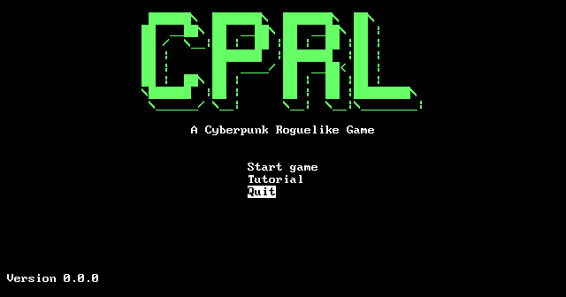
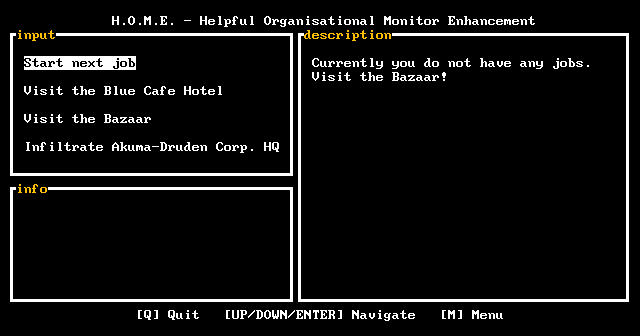

# cprl
> cyberpunk roguelike

This is a work in progress, still in the *very* early stages of development. 

See [OUTLINE](./OUTLINE.md) for initial thoughts on the game's design.

See [INSTALL](./INSTALL.md) for installation instructions.

